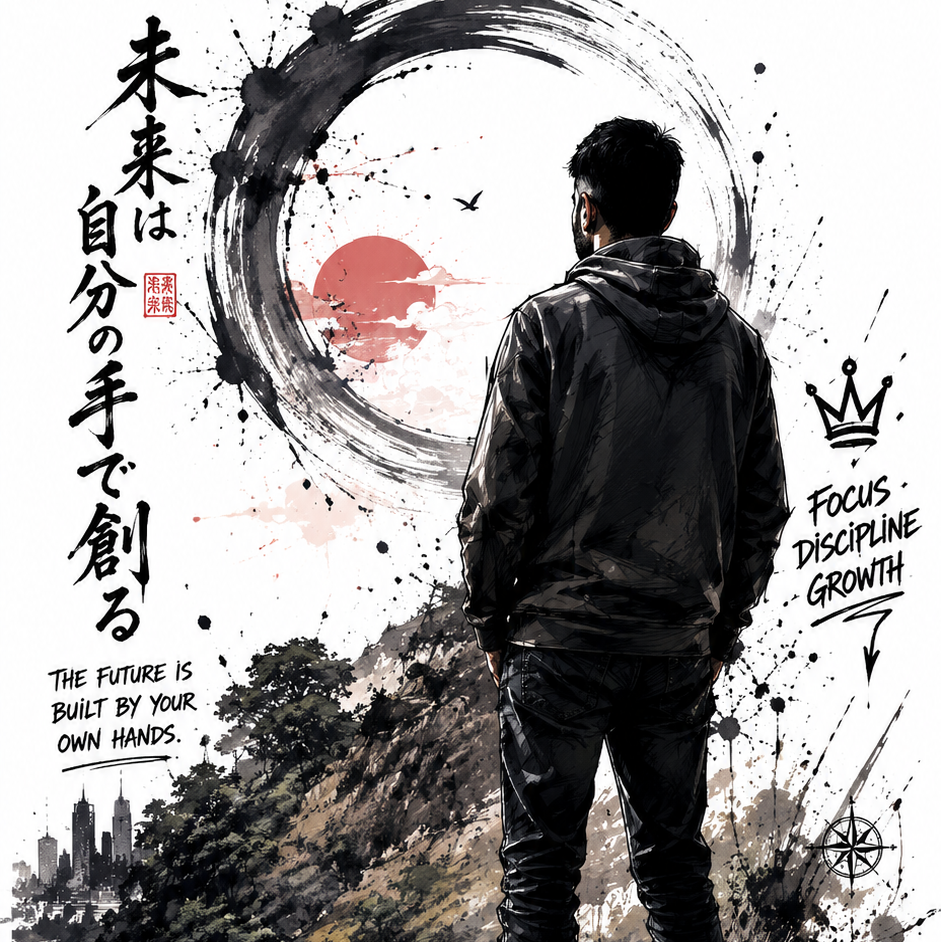

<div align="center">


[](https://git.io/typing-svg)

</div>

<br/>

```text
▄▄▄▄▄▄▄▄▄▄▄▄▄▄▄▄▄▄▄▄▄▄▄▄▄▄▄▄▄▄▄▄▄▄▄▄▄▄▄▄▄▄▄▄▄▄▄▄▄▄▄▄▄▄▄▄▄▄▄▄▄▄▄▄▄▄▄▄
  RECOVERED INTELLIGENCE DOSSIER // PARTIALLY DEGRADED STREAM
  [ERROR 0x8A7] REDACTED DATA BLOCK DETECTED IN SECTOR 4
  DOC NO. EZM-████   ·   DATE OF RETRIEVAL: ACTIVE   ·   PAGE 01 / 01
▀▀▀▀▀▀▀▀▀▀▀▀▀▀▀▀▀▀▀▀▀▀▀▀▀▀▀▀▀▀▀▀▀▀▀▀▀▀▀▀▀▀▀▀▀▀▀▀▀▀▀▀▀▀▀▀▀▀▀▀▀▀▀▀▀▀▀▀
```

<br/>

<div align="center">

<table border="0" width="100%" cellpadding="12">
<tr>
<td width="72%" valign="top" align="left">

```yaml
> load subject.log --verbose

SUBJECT        : "MANISH KUMAR"
CODENAME       : "ezManish"
STATUS         : "█ ACTIVE · RECOVERY STATE"
ORIGIN         : "████████████████, India"
CLEARANCE      : "LEVEL 05 ██████████████"
SPECIALTY      : "Backend Systems Engineering"
CURRENT_OBJ    : "Mastering distributed backend architecture"
THREAT_LEVEL   : "Dangerously consistent"
KNOWN_DOCTRINE : "Simplicity is the soul of efficiency."
████████████   : "███ corrupted payload ███"
```

</td>
<td width="28%" valign="middle" align="center">

<kbd></kbd>

<br/>

`[ ID PHOTO — EZM ]`
<br/>
`IDENTITY VERIFIED`

</td>
</tr>
</table>

</div>

<br/>

<div align="center">
<code>[ TRANSMISSION STREAM STABLE ] · SELECT TERMINAL MODE BELOW</code>
</div>

<br/>

<details>
<summary><b>&nbsp; 🟢 [1] &nbsp;RECRUITER_VIEW &nbsp;·&nbsp; EXEC SUMMARY &amp; OUTCOMES</b> &nbsp;&nbsp;&nbsp; <kbd><b>&nbsp;▶ CLICK TO EXPAND&nbsp;</b></kbd> &nbsp;&nbsp; <kbd>LEVEL 2 CLEARANCE</kbd></summary>

<br/>

```yaml
> retrieve vital_stats --format=executive

PRIMARY_STACK : "Java SE / JVM · Spring Boot · MySQL / SQL · REST APIs"
CLEARED_TOOLS : "Git · GitHub · Postman · Render"
VERIFIED_CAP  : "High reliability backend services, distributed systems logic."

DECLASSIFIED_OUTCOMES:
  AEGIS:
    status     : "COVERT RECONNAISSANCE"
    type       : "AI-Powered Women's Safety System"
    camouflage : "Disguised as a fully functional calculator"
    access     : "GRANTED"
  
  CURATIX_VAULT:
    status     : "PRODUCTION READY"
    type       : "Enterprise-Grade Lightweight Full-Stack App"
    target     : "Designed specifically for hackathon teams and project builders"
    access     : "GRANTED"
```

> 🔗 [`→ ACCESS AEGIS REPOSITORY`](https://github.com/ezManish/Aegis.git)
> <br/>
> 🔗 [`→ ACCESS CURATIX VAULT REPOSITORY`](https://github.com/ezManish/CuratiX_Vault.git)

<br/>

</details>

<br/>

<details>
<summary><b>&nbsp; 🟡 [2] &nbsp;DEVELOPER_VIEW &nbsp;·&nbsp; LORE, ANOMALIES &amp; TELEMETRY</b> &nbsp;&nbsp;&nbsp; <kbd><b>&nbsp;▶ CLICK TO EXPAND&nbsp;</b></kbd> &nbsp;&nbsp; <kbd>LEVEL 4 CLEARANCE</kbd></summary>

<br/>

```yaml
> load core_doctrine --history=true

MISSION_TIMELINE:
  2023 : "Entered programming sector. Initialized core logic."
  2024 : "Began backend specialization. Integrated DB & API systems."
  2025 : "Focused on production-grade resilience and distributed scale."
  CURR : "Undergoing architectural evolution."

BEHAVIORAL_FINGERPRINTS:
  obsessive_resilience: true
  known_incidents:
    - "Fought CSS & Spring Security for 6 consecutive hours without hydration."
    - "Refactored working production code at 03:00 AM for absolute cleanliness."
    - "Accidentally optimized prematurely during initial microservice rollouts."

REAL_TIME_TELEMETRY:
  commits_recorded    : "██████████ STABLE"
  debug_success_rate  : "94.2% (OPTIMIZED)"
  caffeine_saturation : "CRITICAL · WARNING"
  system_stability    : "DEGRADED · HIGH INTENTIONALITY"
```

<div align="center">

<br/>

*ACTIVE CONTRIBUTION MATRIX MAP FEED*

<picture>
  <source media="(prefers-color-scheme: dark)" srcset="https://raw.githubusercontent.com/ezManish/ezManish/output/github-contribution-grid-snake-dark.svg">
  <source media="(prefers-color-scheme: light)" srcset="https://raw.githubusercontent.com/ezManish/ezManish/output/github-contribution-grid-snake.svg">
  
</picture>

</div>

<br/>

</details>

<br/>

<details>
<summary><b>&nbsp; 🔴 [3] &nbsp;DEEP_ARCHIVE &nbsp;·&nbsp; FORBIDDEN SECTOR</b> &nbsp;&nbsp;&nbsp; <kbd><b>&nbsp;▶ CLICK TO EXPAND&nbsp;</b></kbd> &nbsp;&nbsp; <kbd>STRICT PROTOCOL</kbd></summary>

<br/>

```yaml
> access forbidden_sector
ACCESS: DENIED
> access forbidden_sector --force-override
ACCESS: DENIED
> bypass handshake --inject-credentials=ezManish
ACCESS: GRANTED

██████████████████████████████████████████████████████████████████████████████
  [ CRITICAL INCIDENT REPORT ] · SYSTEM BREACH DETECTED
██████████████████████████████████████████████████████████████████████████████

MESSAGE: "You bypassed the standard stream logic to read this raw block."

CURRENT_OBSESSION   : "Building highly resilient backend architecture that survives unforgiving load at scale."
CURRENT_WEAKNESS    : "Attempting to perfect every layer of abstraction before launch."
UNSPOKEN_TRUTH      : "The best architectures are the ones you don't have to fight."
LAST_RECORDED_EVENT : "Uncaught Curiosity Exception handled successfully."
```

<br/>

</details>

<br/>

<div align="center">
<code>[ VIEWS COMPILED ] · EXTERNAL FEEDS LINKED BELOW</code>
</div>

<br/>

<details>
<summary><b>&nbsp; 🌐 &gt; establish contact_protocol --channels=all</b> &nbsp;&nbsp;&nbsp; <kbd><b>&nbsp;▶ CLICK TO EXPAND&nbsp;</b></kbd> &nbsp;&nbsp; <kbd>UNRESTRICTED ACCESS</kbd></summary>

<br/>

```yaml
CHANNEL        : IDENTIFIER                         | ENCRYPTION | STATUS
────────────────────────────────────────────────────────────────────────────
LinkedIn       : "/in/manish-kumar-16a2b932a"       | STANDARD   | MONITORED
Gmail          : "manishkumarmgs019@gmail.com"      | TLS        | ACTIVE
GitHub         : "github.com/ezManish"              | PUBLIC     | OPEN
Stack_Overflow : "/users/32613580"                  | PUBLIC     | OPEN
```

<div align="center">
<br/>

[](https://linkedin.com/in/manish-kumar-16a2b932a)
[](mailto:manishkumarmgs019@gmail.com)
[](https://github.com/ezManish)
[](https://stackoverflow.com/users/32613580)

<br/><br/>


</div>

<br/>

</details>

<br/>

```text
▄▄▄▄▄▄▄▄▄▄▄▄▄▄▄▄▄▄▄▄▄▄▄▄▄▄▄▄▄▄▄▄▄▄▄▄▄▄▄▄▄▄▄▄▄▄▄▄▄▄▄▄▄▄▄▄▄▄▄▄▄▄▄▄▄▄▄▄
  CLASSIFICATION: TOP SECRET   ·   DO NOT REPRODUCE   ·   MONITORED
  FILE NO. EZM-████   ·   COMPILED BY: ezManish   ·   TERMINAL SESSION CLOSED
▀▀▀▀▀▀▀▀▀▀▀▀▀▀▀▀▀▀▀▀▀▀▀▀▀▀▀▀▀▀▀▀▀▀▀▀▀▀▀▀▀▀▀▀▀▀▀▀▀▀▀▀▀▀▀▀▀▀▀▀▀▀▀▀▀▀▀▀
```

<div align="center">
<sub><i>File No. EZM-████ &nbsp;·&nbsp; Access is consent to monitoring &nbsp;·&nbsp; ezManish</i></sub>
</div>